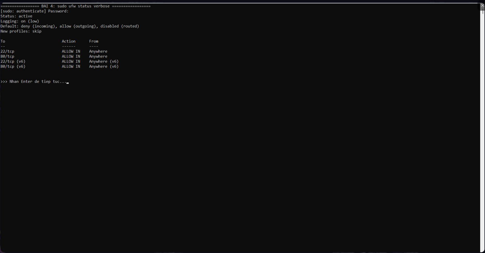
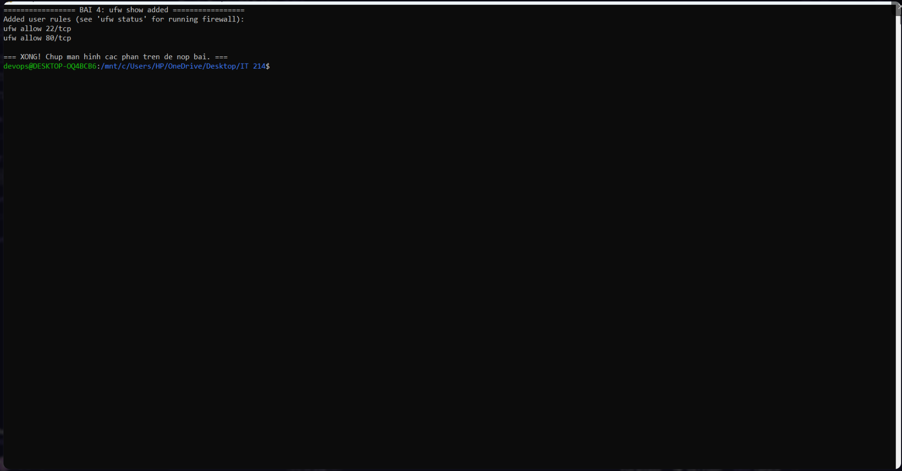

# Bài 4: Cấu hình tường lửa bảo vệ máy chủ (UFW & Cloud Firewall Integration)

## 1. Mục tiêu

- Thiết lập tường lửa **UFW (Uncomplicated Firewall)** ngay trong hệ điều hành Ubuntu để lọc gói tin mạng đi vào máy chủ.
- Kết hợp **DigitalOcean Cloud Firewall** ở tầng hạ tầng để chặn lưu lượng ngay từ biên mạng, trước khi gói tin chạm tới Droplet.
- Kết quả: chỉ cho phép **SSH (22/tcp)** và **HTTP (80/tcp)** đi vào, chặn hoàn toàn các cổng còn lại.

## 2. Kiến trúc bảo vệ 2 lớp

| Lớp | Vị trí | Công cụ | Vai trò |
|-----|--------|---------|---------|
| Lớp 1 | Trong OS (Droplet) | UFW | Lọc gói tin ở mức kernel/netfilter của Ubuntu |
| Lớp 2 | Biên mạng (hạ tầng) | DigitalOcean Cloud Firewall | Chặn lưu lượng trước khi chạm đến Droplet |

Việc dùng đồng thời cả 2 lớp giúp giảm bề mặt tấn công: kể cả khi cấu hình sai ở một lớp, lớp còn lại vẫn bảo vệ.

## 3. Ràng buộc

- **Lớp 1 (UFW):** `default deny incoming`, `default allow outgoing`, mở `22/tcp` và `80/tcp`.
- **Lớp 2 (Cloud Firewall):** Inbound chỉ cho phép SSH (22) và HTTP (80), gán Droplet vào firewall.

## 4. Thực hiện

### 4.1. Lớp 1 — Cấu hình UFW trong Ubuntu

Cài đặt UFW (thường có sẵn trên Ubuntu):

```bash
sudo apt update
sudo apt install -y ufw
```

Thiết lập chính sách mặc định và mở các cổng cần thiết:

```bash
sudo ufw default deny incoming
sudo ufw default allow outgoing
sudo ufw allow 22/tcp
sudo ufw allow 80/tcp
sudo ufw --force enable
```

> Sử dụng `--force` khi chạy script để tránh câu hỏi xác nhận `Command may disrupt existing ssh connections`.

Kiểm tra trạng thái:

```bash
sudo ufw status verbose
```

### 4.2. Lớp 2 — DigitalOcean Cloud Firewall

1. Đăng nhập **DigitalOcean Console** → menu **Networking** → **Firewalls**.
2. Bấm **Create Firewall**, đặt tên ví dụ `ptit-web-firewall`.
3. Cấu hình **Inbound Rules**:

   | Type | Protocol | Port Range | Sources |
   |------|----------|------------|---------|
   | SSH  | TCP      | 22         | All IPv4 / All IPv6 (hoặc IP cá nhân) |
   | HTTP | TCP      | 80         | All IPv4 / All IPv6 |

4. Phần **Outbound Rules**: giữ mặc định (allow all) hoặc giới hạn nếu cần.
5. Mục **Apply to Droplets**: chọn Droplet của bạn để gán vào firewall.
6. Bấm **Create Firewall**.

## 5. Kiểm tra

### 5.1. Trên Droplet

```bash
sudo ufw status verbose
```

Kết quả thực tế (Ubuntu 26.04.1 LTS):

```
Status: active
Logging: on (low)
Default: deny (incoming), allow (outgoing), disabled (routed)
New profiles: skip

To                         Action      From
--                         ------      ----
22/tcp                     ALLOW IN    Anywhere
80/tcp                     ALLOW IN    Anywhere
22/tcp (v6)                ALLOW IN    Anywhere (v6)
80/tcp (v6)                ALLOW IN    Anywhere (v6)
```

Trạng thái `active` và chỉ có 22/tcp, 80/tcp là `ALLOW IN`.

### 5.2. Từ máy cá nhân

```bash
# SSH phải kết nối được
ssh devops@<DROPLET_IP>

# HTTP cổng 80 phải truy cập được
curl -I http://<DROPLET_IP>

# Cổng khác (ví dụ 3306) phải bị chặn / timeout
nc -zv <DROPLET_IP> 3306
```

Kết quả mong đợi:

- SSH đăng nhập thành công.
- `curl` trả về `HTTP/1.1 200 OK`.
- `nc` tới cổng 3306 bị `Connection refused`/`timeout`.

### 5.3. Bảng tổng hợp

| Cổng | Dịch vụ | Kết quả |
|------|---------|---------|
| 22/tcp | SSH | Cho phép |
| 80/tcp | HTTP | Cho phép |
| 3306/tcp | MySQL | Bị chặn |
| 443/tcp | HTTPS | Bị chặn |

## 6. Ảnh chụp màn hình





## 7. Kết luận

- UFW hiển thị `Active`, chỉ cho phép 22/tcp và 80/tcp đi vào.
- Cloud Firewall tạo thêm lớp bảo vệ ở biên mạng, gán vào Droplet.
- SSH và HTTP hoạt động bình thường, các cổng khác bị chặn hoàn toàn.
